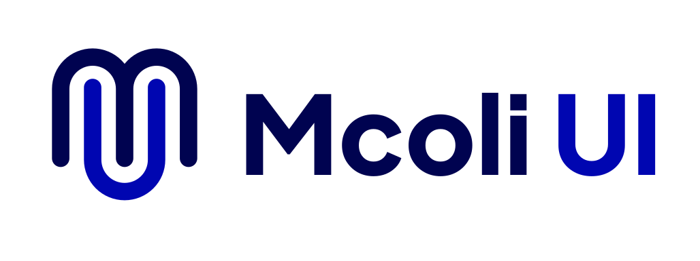
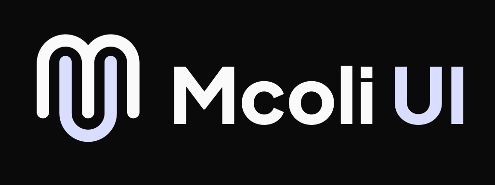

<p align="center">
  
  
</p>

<p align="center">
  <b>Stop building from scratch. Elevate your UI with MicroClub DNA.</b>
</p>

<p align="center">
  <a href="https://github.com/MicroClub-USTHB/mcoli-ui/stargazers">
    
  </a>
  <a href="https://github.com/MicroClub-USTHB/mcoli-ui/issues">
    
  </a>
  <a href="https://github.com/MicroClub-USTHB/mcoli-ui/blob/main/LICENSE">
    
  </a>
</p>

---

## Build Faster. Design Better.

**mcoli-ui** is the premier React component library that brings professional-grade UI components with a bold **MicroClub DNA** to developers everywhere. We’ve combined world-class design standards with an elite visual identity to help you build stunning web applications in record time.

Stop fighting with generic components. **Infuse your project with signature UI.**

### Why Developers Choose mcoli-ui:

- **Elite Visual Identity**: 5 custom-engineered themes (Primary, Secondary, Game Dev, Robotics, IT) infused with our signature DNA.
- **Instant Deployment**: Inject high-performance components directly into your workspace with a single command.
- **Rock-Solid Accessibility**: Built on top of **@base-ui/react** for world-class accessible primitives and behavior.
- **Peak Performance**: Optimized for the future with **Next.js 16**, **Tailwind CSS v4**, and **TypeScript 6**.
- **Ultimate Customization**: Your code, your vision. Since components are copied directly to your project, you have 100% control.

## Quick Start

### 1. Ready your Project

mcoli-ui integrates with the industry-standard shadcn workflow. Ensure your framework is set up:

- **New Projects**: Launch with [shadcn/create](https://ui.shadcn.com/create) for a perfect start.
- **CLI**: Run `npx shadcn@latest init -t [framework]` (supports `next`, `vite`, `start`, `react-router`, and `astro`).
- **Existing Projects**: Add the foundation via the [official installation guide](https://ui.shadcn.com/docs/installation).

```bash
npx shadcn@latest init
```

### 2. Ignite mcoli-ui

Initialize the library and unlock our exclusive theme engine:

```bash
npx mcoli-ui@latest init
```

### 3. Add Your First Component

Grab a premium component and start building:

```bash
npx mcoli-ui@latest add mc-button
```

## The Library Advantage

mcoli-ui is more than just a registry; it’s a **Professional Component Library** designed for the modern web.

1. **Signature Design**: Every pixel is aligned with MicroClub's high design standards.
2. **Built for Performance**: No bulk. No unused dependencies. Just the code you need to shine.
3. **Inclusive UI**: We handle the complex ARIA and keyboard logic so you don't have to.

## Tech Stack

<div align="center">
  
  
  
  
</div>

## Join the Mission

We’re on a quest to build the ultimate UI toolkit. Contribute your components and help us set a new standard. See [CONTRIBUTING.md](CONTRIBUTING.md).

---

<p align="center">
  Developed with passion by the <b>Dev Department</b> of <a href="https://microclub.info">MicroClub</a>
</p>
